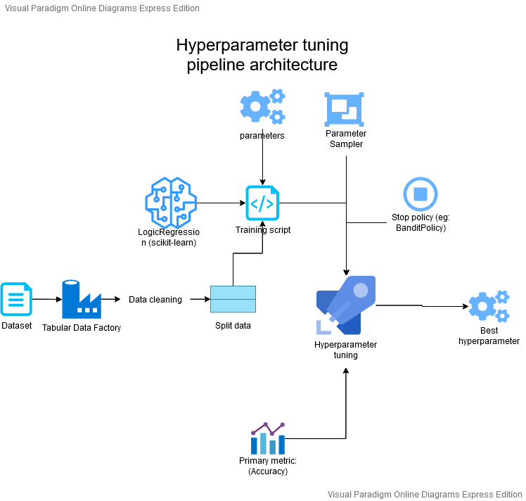
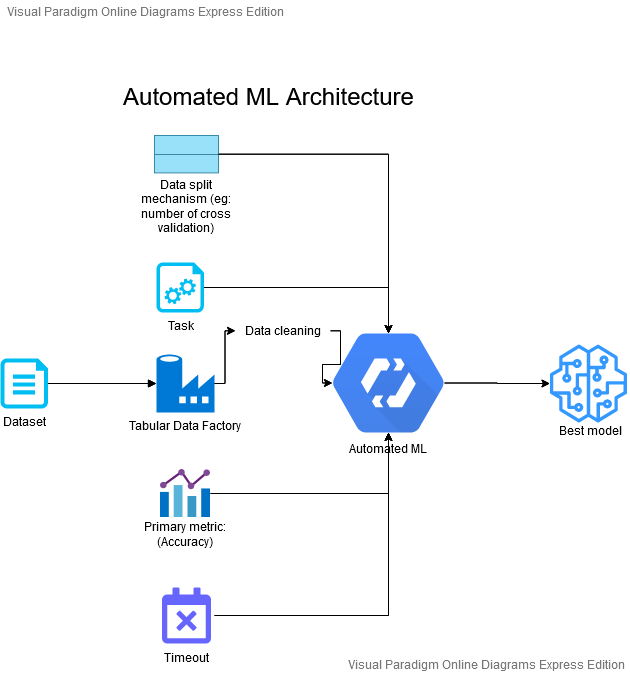

# Optimizing an ML Pipeline in Azure

## Overview
This project is part of the Udacity Azure ML Nanodegree.
In this project, we build and optimize an Azure ML pipeline using the Python SDK and a provided Scikit-learn model.
This model is then compared to an Azure AutoML run.

## Summary
**In 1-2 sentences, explain the problem statement: e.g "This dataset contains data about... we seek to predict..."**

This dataset contains data about a marketing campaign initiated by a bank, several information about the customers that
were reached out concerning the campaign are provided, information like when last they were contacted, how long the 
conversation lasted, their marital status etc... With this data we seek to predict how likely the customers are to
subscribe to the product being advertised.

**In 1-2 sentences, explain the solution: e.g. "The best performing model was a ..."**
The best performing model was the VotingEnsemble classification algorithm: with 91.557% accuracy. AutoML, after running several algorithms this one has the best accuracy, better than the tuned (hyperparemeter tuning) scikit-learn LogicRegression algorithm which only attains a 91.411% accuracy.

## Scikit-learn Pipeline
**Explain the pipeline architecture, including data, hyperparameter tuning, and classification algorithm.**

We use the LogicRegression algorithm provided by scikit-learn to train and test the data. To accomplish this
- We first clean the data and extract the label into a different dataframe.
- We split the data into the test and training samples (20% used for training and 80% for testing)
- We setup hyperparameter tuning to determine the best possible value for the ``inverse of regularization strength`` parameter of the logic regression algorithm from the uniform space between 0.5 and 2.0
- We setup the hyperparameter tuning to stop 

The hyparameter tuning results with a best accuracy of ``91.411%`` with (``Inverse of regularization strength: 1.1208076031757939``, ``number of iteration: 150``).


**What are the benefits of the parameter sampler you chose?**
We use a Random sampler for the hypertuning. This sampler is good because it first supports early termination policies and it allows to pick value over a continuous range. In our case we want to pick the optimal for the ``inverse of regularization strength`` to squeeze out the last drop of performance of the logic regression algorithm. It is a floating point value so we need a continuous range.

**What are the benefits of the early stopping policy you chose?**
The BanditPolicy used to stop the hyperparemeter tuning helps to stop the process when there is a considerable drop in
``Accuracy``(metric being checked against). We stop the process when the accuracy drop by ``0.2`` after 3 runs.

## AutoML
**In 1-2 sentences, describe the model and hyperparameters generated by AutoML.**
The VotingEnsemble model is a very robust machine learning model that uses several other models to make predictions using weighted averages, by pick the majority vote made by those models; running automl on our dataset with a primary metric of ``AUC_weighted`` returns VotingEnsemble as being the best performing model,  ``AUC_weighted`` the data is not really balanced; in our case the primary hyperparemeter to be tuned is accuracy which has the value of 91.76% for the best run. VotingEnsemble ``ensembled`` several models with a weight associated to them to make the predictions including:

```
Models(estimators): [(MaxAbsScaler) LightGBM, (SparseNormalizer) XGBoostClassifier, (StandardScalerWrapper) XGBoostClassifier, (MaxAbsScaler) XGBoostClassifier, (TruncatedSVDWrapper) XGBoostClassifier, (SparseNormarlizer) XGBoostClassifier, (MaxAbsScaler) SGD] 

weights: [0.5333333333333333, 0.06666666666666667, 0.06666666666666667, 0.13333333333333333, 0.06666666666666667, 0.06666666666666667, 0.06666666666666667]
```

Let's consider the last model in the list above ``(MaxAbsScaler) SGD`` used by the VotingEnsemble; this model has several hyperparamters including
```
{'alpha': 0.6123387755102041,
 'class_weight': None,
 'eta0': 0.01,
 'fit_intercept': True,
 'l1_ratio': 0.4081632653061224,
 'learning_rate': 'constant',
 'loss': 'hinge',
 'max_iter': 1000,
 'n_jobs': 1,
 'penalty': 'none',
 'power_t': 0.8888888888888888,
 'random_state': None,
 'tol': 0.001}
```
AutoML is able to able to fetch appropriate values for these hyperparameters for better performance.

## Pipeline comparison
**Compare the two models and their performance. What are the differences in accuracy? In architecture? If there was a difference, why do you think there was one?**




The hyperparemeter tuning and automl are quite different. 

AutoML is much more powerful because it runs a great variety of models and picks the best performing one (in only one pipeline run), whereas hyperparemeter tries to squeeze out only a single model to get the best possible run for it given some metrics, basically you would have to run hyperparemeter tuning for all the models ran by automl one after the other and then compare their results to achieve what autoML does with hyperparemeter tuning.

Another difference in their architecture is how the data is splitted into test and train samples. For the hyperparameter tuning of scikit-learn LogicRegression, we split the data as such: 20% for training and the rest for testing. Whereas for the autoML pipeline we a five fold cross validation (``n_cross_validation = 5``), whereby five different trainings, each training using 4/5 of the data, and each validation using 1/5 for validation.

In conclusion hyperparemeter tuning can be the way to go when you are sure that the model you are picking is the best option, otherwise autoMl proves to be a good approach.

## Future work
**What are some areas of improvement for future experiments? Why might these improvements help the model?**
To improve on the model some more data cleaning could be done. The ``default`` column for example does not seem to be playing an important role (most of the row have the same ``default`` value), so we need to drop this column. We could also test the numerical columns (``age, balance, duration etc...``for outliers and remove them. Outliers need to be removed because they skewed the results of predictions in their direction which is not a wanted behaviour. 

## Proof of cluster clean up
**If you did not delete your compute cluster in the code, please complete this section. Otherwise, delete this section.**
**Image of cluster marked for deletion**
The compute cluster was deleted in the code: ```compute_cluster.delete() ```
